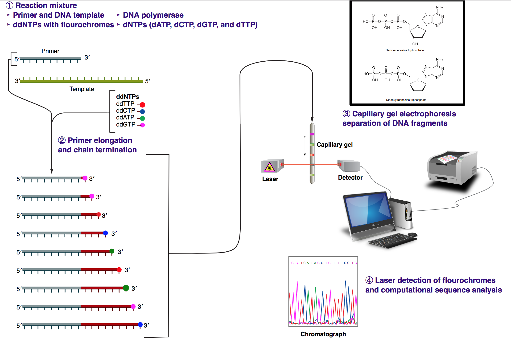

#1 Sanger sequencing

note1: As there is a lack of Oxygen in 3' carbon for ddATP,ddTTP,ddGTP,ddCTP, the chain will not continue.

note2: for the gel, the small dna string run fast.

note3: the length of  Sanger sequencing can reach 600 DB, because the the running speed is proportion to $\frac{1}{log(length)}$, so it is difficult to differentiate too long sequence.

note4: For the initial sanger sequencing, there is no flurent for ddATP,ddTTP,ddGTP,ddCTP. they use redioactive phasphorate for the primer.

#2 Next generation sequencing

Next generation sequencing is rather complex, I find [this presentation](https://users.ugent.be/~avierstr/nextgen/nextgen.html) most readable.  [presentation](Next_generation_sequencing_2018_web.pdf), [explanation](Next_generation_sequencing_explanation_2018_web.pdf)
