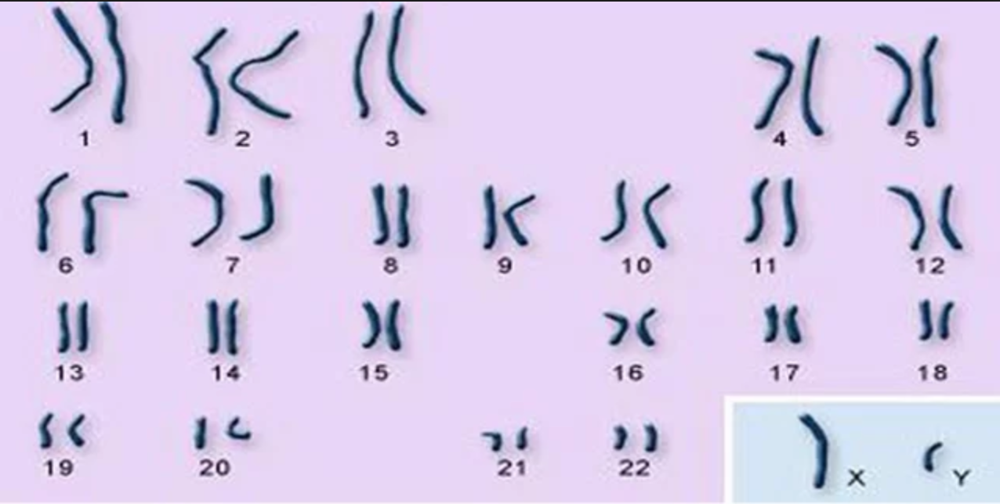
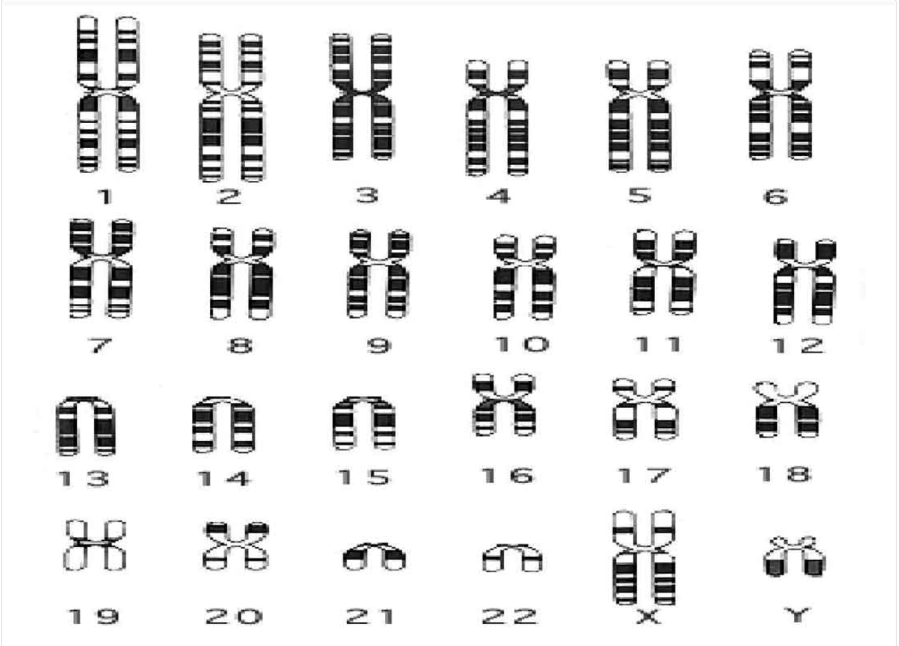
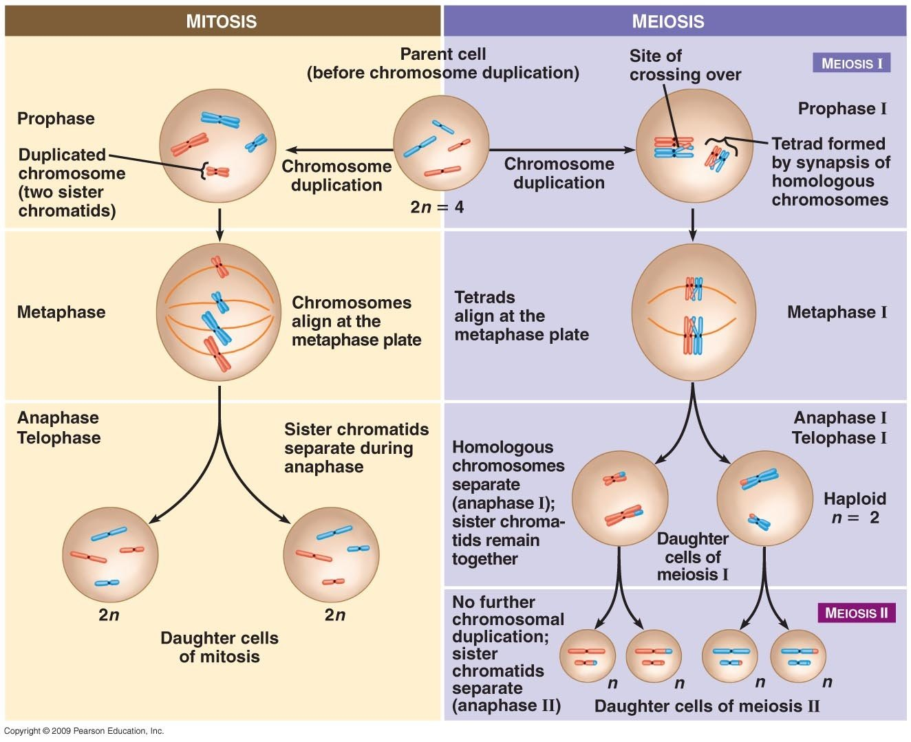
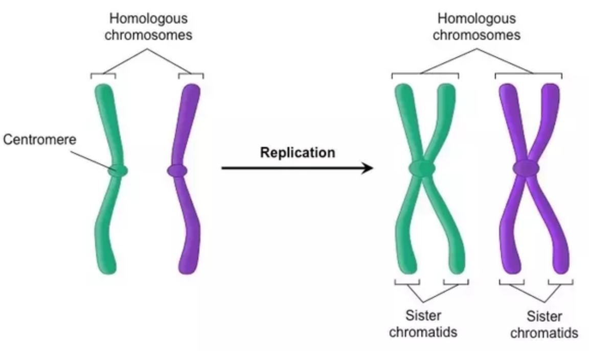
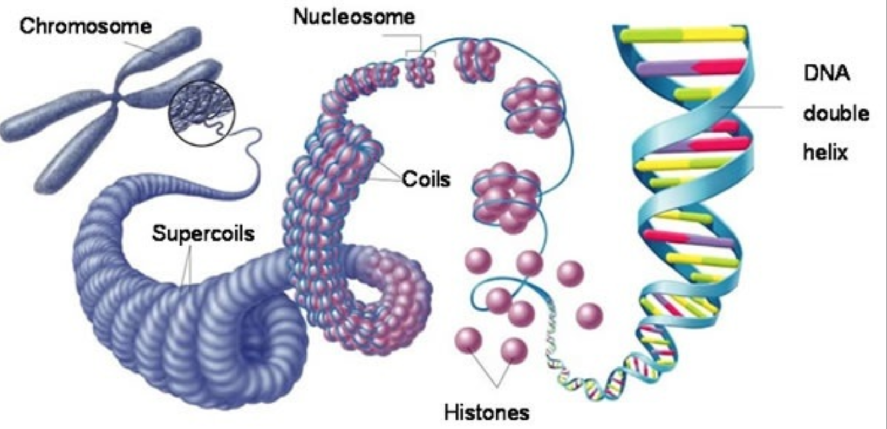

We know human has 23 pair of homozygous chromosomes. For each pair, one comes from father, the other comes from mother. However, I am confused on the following pictures on humman chromesomes before this writing.

Which one is that the right picture? The answer is the first picture is right. the second picture exists only when the process of mitosis or meiosis begin. see the following figure.

Simply speaking, for mitosis, each of the 46 chromosomes replicate itself, one chromosome becomes a pair of sister chromatids; then all these 46 pair of chomatids are aligned in a line; finally the separate to form two cell.

for meiosis, each of the 46 chromosomes replicate itself but homologous chromosomes get together to form Tetrad, where the crossing over occur; then all the 23 Tetrads are aligned in a line; next homologous chromosome separate to form two cell; finally each pair of chomatid in a cell separate to form two gamete.

Useful pictures to clear some concepts

I serched many pictures, and all the chromosome are shown in sister chromatids format. I guess it is because we can see the chromosome in this stage.
