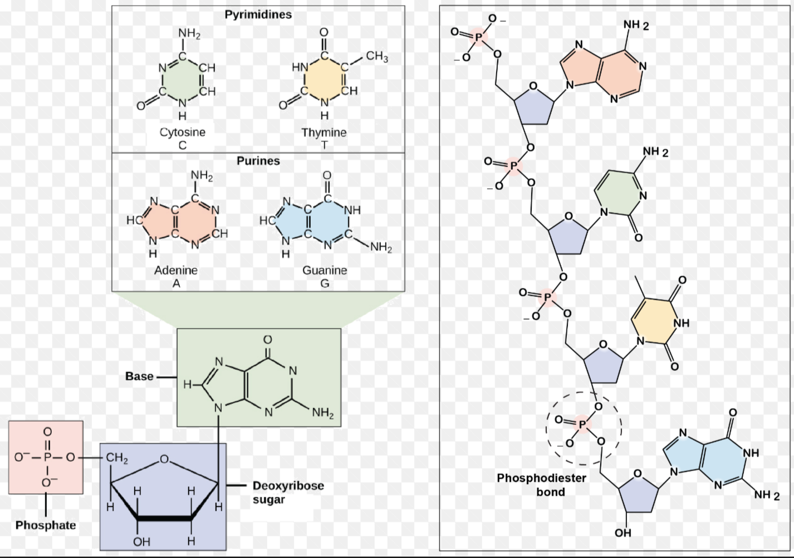
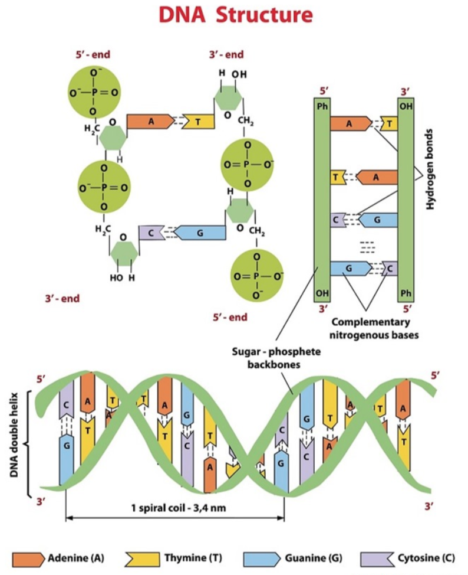

#1 structure of DNA

In fact, it is easy to remember the molecular structure of DNA. First, there is a 2'-deoxyribose (pentose or 五糖)， 1'-carbon connects to a base, 5'-carbon connects to a phosphate group which connects to the next deoxyribose at 3'.  A nucleotide contains one base, one deoxyribose and one tri-phosphate. It is important to remember that the 5' end of dna is the 3' carbon side.

